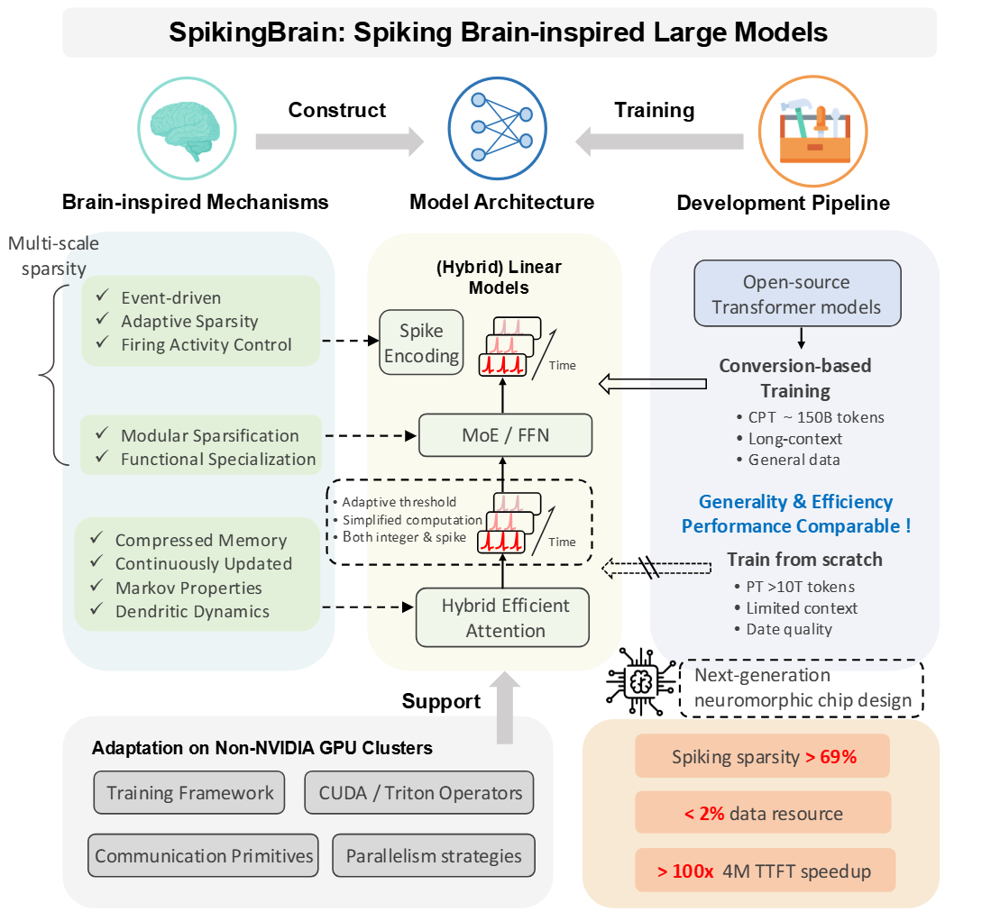
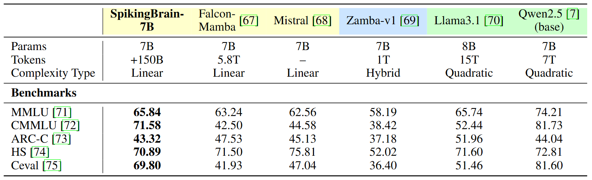
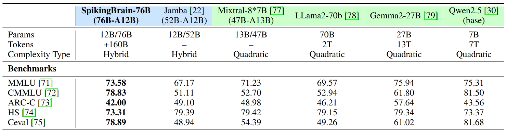

# SpikingBrain：Spiking Brain-inspired Large Models

📄 Technical Report: [Chinese](SpikingBrain_Report_Chi.pdf) | [English](SpikingBrain_Report_Eng.pdf)  
🚀 Arxiv: [arXiv:2509.05276](https://www.arxiv.org/abs/2509.05276)  
🧩 Models: [Available Models](#available-models)   
🔗 Demo: [OpenBayes贝式计算](https://openbayes.com/console/public/tutorials/eKBhv3jUkWw)    

---

## About SpikingBrain

Inspired by brain mechanisms, **SpikingBrain** integrates **hybrid efficient attention**, **MoE modules**, and **spike encoding** into its architecture, supported by a universal conversion pipeline compatible with the open-source model ecosystem. This enables continual pre-training with less than 2\% of the data while achieving performance comparable to mainstream open-source models. We further adapt frameworks, operators, parallel strategies, and communication primitives for **non-NVIDIA (MetaX) clusters**, ensuring stable large-scale training and inference. SpikingBrain achieves over 100× speedup in TTFT for 4M-token sequences, while spiking delivers over 69\% sparsity at the micro level. Combined with macro-level MoE sparsity, these advances provide valuable guidance for the design of next-generation neuromorphic chips.



---

## Project Structure
This repository provides the full implementation and weights of **SpikingBrain-7B**, including the **HuggingFace version**, **vLLM inference version**, and **quantized version**, enabling flexible deployment and research across different scenarios.

```
SpikingBrain-7B/
├── hf_7B_model/ # HuggingFace version
├── run_model/   # Model run examples
├── vllm_hymeta/ # vLLM plugins and inference support
├── W8ASpike/    # Quantized inference version
├── setup.py
├── requirements.txt 
└── README.md 
```

--- 

## vLLM-HyMeta

**vllm-hymeta** is the plugin adaptation of HyMeta (Hybrid Models built on MetaX GPUs) for the [vLLM inference framework](https://github.com/vllm-project/vllm/tree/main), providing efficient inference support on NVIDIA GPUs.

By leveraging the [plugins mechanism](https://blog.vllm.ai/2025/05/12/hardware-plugin.html) in vLLM, hardware backends can be integrated in a modular fashion, bringing the following benefits:

- **Decoupled codebase**: Backend-specific code remains independent, keeping the vLLM core cleaner.

- **Reduced maintenance cost**: vLLM developers can focus on general functionality without being affected by backend-specific implementations.

- **Faster integration**: New backends can be integrated quickly and evolve independently with less engineering effort.

### Container Deployment (NVIDIA)
```bash
git clone https://github.com/BICLab/SpikingBrain-7B.git
cd SpikingBrain-7B
docker build -t spiking-brain:7b-v1.0 .
```
```bash
docker run -itd \
    --entrypoint /bin/bash \
    --network host \
    --name <container_name> \
    --shm-size 160g \
    --gpus all \
    --privileged \
    -v /host_path:/container_path \
    spiking-brain:7b-v1.0
```

Recommended environment for installing **vllm-hymeta** on NVIDIA GPUs:

```makefile
torch==2.7.1
transformers==4.55.2
triton==3.3.1
flash_attn==2.7.3
flash-linear-attention==0.1
vllm==0.10.0
scipy
pyyaml
decorator
setuptools
setuptools-scm
```

### Run with vLLM

You can serve a model with vLLM in the simplest way using the following command:

```bash
vllm serve <your_model_path> \
  --served-model-name <model_name> \
  --gpu-memory-utilization <ratio> \
  --block-size <size> \
  --dtype bfloat16 \
  --port <port_number>
```

You may also set `--tensor-parallel-size` and `--pipeline-parallel-size` when launching if you want to run with multiple GPUs. 

---

## W8ASpike

**W8ASpike** is the quantized inference version of SpikingBrain-7B, aiming to reduce inference cost under low-precision settings and explore the potential of Spiking Neural Networks (SNNs).

The current implementation adopts **pseudo-spiking**, where activations are approximated as spike-like signals at the tensor level, rather than true asynchronous event-driven spiking on neuromorphic hardware.

- **Pseudo-spiking**: Efficient approximation at the tensor level, suitable for prototyping and research.

- **True-spiking**: Requires asynchronous hardware and event-driven operator support, which is beyond the scope of this repository.

The activation spike encoding process here is inspired by the pseudo-spiking interfaces from [BICLab/Int2Spike](https://github.com/BICLab/Int2Spike). For additional PyTorch-based spiking interfaces, please refer to the Int2Spike library.

---

## Available Models
The model weights are hosted on **ModelScope**. Please select the appropriate version based on your needs:

- **Pre-trained model (7B):** https://www.modelscope.cn/models/Panyuqi/V1-7B-base
- **Chat model (7B-SFT):** https://www.modelscope.cn/models/Panyuqi/V1-7B-sft-s3-reasoning
- **Vision-Language model (7B):** https://www.modelscope.cn/models/sherry12334/SpikingBrain-7B-VL/files
- **Quantized weights (7B-W8ASpike):** https://www.modelscope.cn/models/Abel2076/SpikingBrain-7B-W8ASpike

### Usage
Example scripts are provided in [`run_model/`](run_model) for running the model with the released checkpoints. 

- **Hugging Face**  
Load with `AutoModelForCausalLM` and use as a standard CausalLM (forward or generation); see [`run_model/run_model_hf.py`](run_model/run_model_hf.py).  
For the SFT model, a chat template is used; see [`run_model/run_model_hf_chat_template.py`](run_model/run_model_hf_chat_template.py).

- **vLLM**  
Perform inference using the provided **vLLM Hymeta** plugin; see [`run_model/run_model_vllm.py`](run_model/run_model_vllm.py) and the [vLLM Hymeta](#vllm-hymeta) section.   
Please make sure to remove the `auto_map` field from `config.json`. Specifically, delete the following block if it is present:
```json
"auto_map": {
  "AutoConfig": "configuration_gla_swa.GLAswaConfig",
  "AutoModelForCausalLM": "modeling_gla_swa.GLAswaForCausalLM"
}
```

> For tested environment, please refer to [requirements.txt](requirements.txt).

### Performance Evaluation
Table 1: **Performance evaluation of the SpikingBrain-7B pre-trained model.** All models are tested with the HuggingFace framework and evaluated using a perplexity-based method. Except for Qwen2.5, the other baselines are trained on limited Chinese data, resulting in clear disadvantages on CMMLU and C-Eval.



Table 2: **Performance evaluation of the SpikingBrain-76B pre-trained model.** All models are tested with the vLLM framework and evaluated using a perplexity-based method. Except for Qwen2.5, the other baselines are trained on limited Chinese data, resulting in clear disadvantages on CMMLU and C-Eval.


--- 

## Citation

If you find our work useful, please consider citing **SpikingBrain**:

```bibtex
@article{pan2025spikingbrain,
  title={SpikingBrain Technical Report: Spiking Brain-inspired Large Models},
  author={Pan, Yuqi and Feng, Yupeng and Zhuang, Jinghao and Ding, Siyu and Liu, Zehao and Sun, Bohan and Chou, Yuhong and Xu, Han and Qiu, Xuerui and Deng, Anlin and others},
  journal={arXiv preprint arXiv:2509.05276},
  year={2025}
}

```
